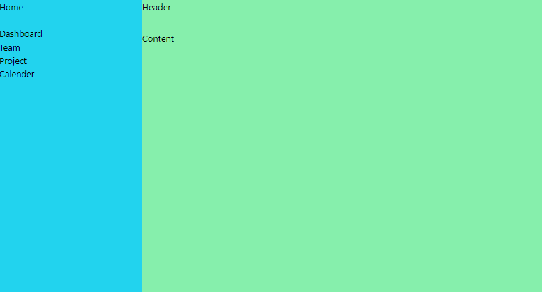

# Aufabge 1 (10-15 Minuten)

## Setup neue Component

Entwickeln Sie eine Komponente mit dem Namen `Sidebar.vue`, die Komponente muss aus 3 Teilen bestehen, einem Header, einer Sidebar, einem Content.Erstellen Sie dann eine Navigationsliste im Bereich der Sidebar wie im Beispiel.

