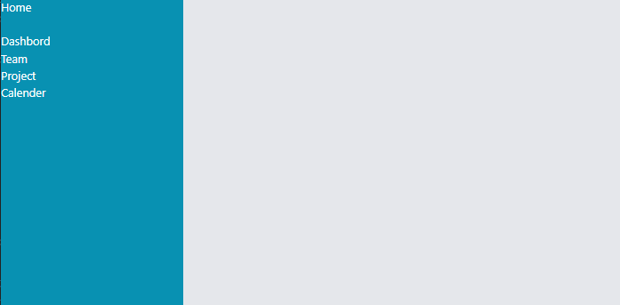

# Aufabge 1 (10-15 Minuten)

## Setup neue Component

Entwickeln Sie 2 Komponenten mit den Namen `Sidebar.vue` und `Login.vue`. Die `Sidebar.vue` muss als die Hauptkomponente betrachtet werden.

in `Sidebar.vue` eine Navigationsliste wie im Beispiel erstellen

Erstellen sie in der `Anmelden.vue` einen Contentbereich, der in Aufgabe 3 weiter entwickelt werden muss.