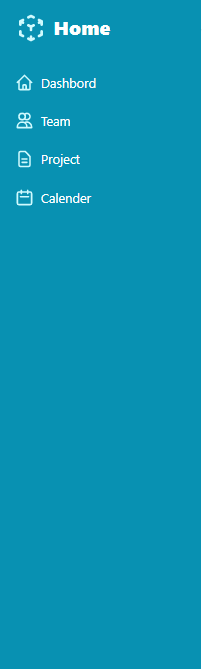

## Aufgabe 2 (20-25 Minuten)

Die Navigationsleiste mit den Tailwind-CSS-Klassen erweitern.

Sie haben 2 Möglichkeiten für die Icons, entweder mit [Heroicons](https://heroicons.com/) , die ich vorher vorbereitet habe, im Icon-Ordner als SVG-Datei, oder Sie können mit dem [Bootstrap-Icon](https://icons.getbootstrap.com/) arbeiten und dort nach anderen Icons suchen und diese verwenden.

